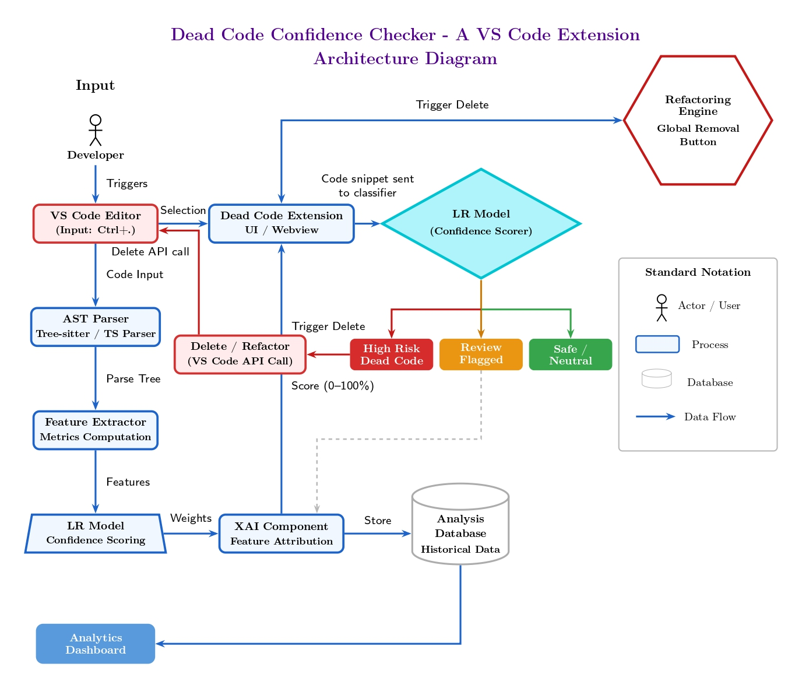

# MP Phase 2: Dead Code Confidence Checker

Dead Code Confidence Checker (DCC) is a VS Code extension project for identifying potentially unused code with machine learning, explainable reasoning, and persistent analysis history. This repository also includes the supporting Python analyzer, SQLite storage layer, ML assets, and a small ETL-style test project used to exercise the analyzer against realistic code smells and dead-code scenarios.

## Project Goals

- Detect potentially dead functions and classes using static analysis plus ML scoring.
- Surface confidence scores directly inside VS Code with inline badges and dashboard views.
- Generate explainable reasoning for each prediction using feature attribution and optional LLM support.
- Store analysis history, explanations, chat interactions, and removal logs in SQLite.
- Provide a sample target codebase with dynamic calls, dead code, and complexity patterns for validation.

## Architecture

The Phase 2 architecture connects the editor, analysis pipeline, ML model, explanation layer, and persistence components into a single developer workflow.



### High-Level Flow

1. A developer triggers analysis from the VS Code editor.
2. The extension sends the current file or workspace selection to the analysis pipeline.
3. The Python analyzer parses code, extracts features, and scores each entity with the logistic regression model.
4. The XAI layer builds human-readable explanations from model inputs and optional LLM reasoning.
5. Results are shown in the extension UI and dashboard, then stored in the analysis database.
6. High-confidence dead code can be reviewed and removed through VS Code actions.

## Repository Structure

```text
.
|-- dcc/                        VS Code extension source, Python analyzer, webview assets
|   |-- src/                    TypeScript extension source
|   |-- out/                    Compiled extension output
|   |-- analyzer.py             AST + ML analyzer
|   |-- llm_pipeline.py         OpenAI/DeepSeek explanation helpers
|   |-- package.json            Extension manifest and scripts
|   `-- dcc_analysis.db         Local analysis database used by the extension
|-- database/
|   `-- db.py                   SQLite schema initialization and CRUD helpers
|-- dataprep_magic_project/     Sample ETL-style Python project for testing analysis
|   |-- dataprep_magic/         Extract/transform/load modules
|   |-- tests/                  Test files used for usage signals
|   `-- requirements.txt        Python dependencies for the sample project
|-- ML Part/                    Model training assets and generated datasets
|   |-- LR model.py             Logistic regression training script
|   |-- dead_code_model.pkl     Trained dead-code classifier
|   |-- scaler.pkl              Feature scaler used by analyzer.py
|   `-- dead_code_dataset.csv   Dataset used for experiments/training
|-- docs/
|   `-- CODEBASE_OVERVIEW.md    Supplemental project notes
|-- schema.sql                  Reference database schema
|-- python_test.py              Standalone Python file for experiments
|-- generate_project.py         Project scaffolding/helper script
`-- README.md                   Project overview and setup guide
```

## Main Components

### 1. VS Code Extension (`dcc/`)

The extension provides the developer-facing experience:

- command palette actions for file and workspace analysis
- inline confidence badges and highlighting
- dashboard webview for results, history, and review
- chat-style assistant entry point
- dead-code removal actions and history tracking
- auto-analysis on save

Configured commands include:

- `dcc.analyzeFile`
- `dcc.analyzeWorkspace`
- `dcc.openDashboard`
- `dcc.openDashboardForSelection`
- `dcc.removeDeadCode`
- `dcc.showHistory`
- `dcc.openChat`

### 2. Python Analyzer (`dcc/analyzer.py`)

This module performs the core code analysis:

- parses Python files with `ast`
- scans cross-file calls inside the project
- detects references from test files
- extracts features such as:
  - call count
  - export visibility
  - test usage
  - dynamic call risk
  - cyclomatic complexity
  - file depth
- loads the trained model and scaler from `ML Part/`
- generates severity labels (`danger`, `warning`, `review`, `safe`)
- optionally persists sessions and entity results to SQLite

### 3. Explainable AI Layer (`dcc/llm_pipeline.py`)

This layer enriches predictions with explanation output:

- OpenAI-compatible structured JSON explanations
- optional DeepSeek reasoning for secondary analysis
- retry and rate-limit handling
- clean fallback to ML-only explanations when API keys or network access are unavailable

The analyzer works without LLM access. LLM support is additive, not mandatory.

### 4. Database Layer (`database/db.py` and `schema.sql`)

SQLite is used to persist:

- analysis sessions
- detected code entities
- feature vectors
- explanations/XAI payloads
- chat history
- dead-code removal logs

By default, the extension points `DCC_DB_PATH` to `dcc/dcc_analysis.db`.

### 5. ML Assets (`ML Part/`)

The machine learning portion of the project includes:

- a logistic regression classifier
- a fitted scaler for feature normalization
- a dataset and generation scripts for experimentation

The current analyzer expects:

- `ML Part/dead_code_model.pkl`
- `ML Part/scaler.pkl`

### 6. Sample Analysis Target (`dataprep_magic_project/`)

This is a deliberately useful test fixture rather than production code. It includes:

- ETL-style modules for extract, transform, and load stages
- dynamic invocation patterns
- dead or weakly referenced paths
- varying complexity levels
- test files that can influence usage signals

It helps validate whether DCC can distinguish between obviously dead code, ambiguous code, and active code.

## Feature Summary

- ML-based dead code confidence scoring
- AST-driven static feature extraction
- explainable reasoning for each flagged entity
- optional LLM-backed summaries and recommendations
- inline VS Code editor decorations
- dashboard-based inspection and review
- database-backed history and removal logs
- workspace-wide and single-file analysis modes

## Technology Stack

- TypeScript for the VS Code extension
- Python for AST analysis, ML inference, and DB helpers
- SQLite for local persistence
- scikit-learn/joblib for model loading
- optional OpenAI/DeepSeek API integration for XAI enrichment

## Setup

### Prerequisites

- VS Code `1.85+`
- Node.js and npm
- Python 3.x
- pip / virtual environment support

### 1. Clone the repository

```powershell
git clone <your-repo-url>
cd "Project"
```

### 2. Set up Python dependencies

If you want to work with the sample ETL project and analyzer environment:

```powershell
python -m venv venv
.\venv\Scripts\activate
pip install -r .\dataprep_magic_project\requirements.txt
pip install numpy scikit-learn joblib python-dotenv requests
```

### 3. Set up the VS Code extension

```powershell
cd .\dcc
npm install
npm run compile
```

This compiles the extension into `dcc/out/`.

### 4. Configure optional API keys

The repository includes a local `.env` file for development. For a fresh setup, define only the keys you actually need.

Example variables used by `dcc/llm_pipeline.py`:

```env
OPENAI_PROVIDER=openai
OPENAI_API_KEY=your_key_here
OPENAI_MODEL=gpt-4o-mini
OPENAI_BASE_URL=https://api.openai.com/v1

ENABLE_DEEPSEEK=true
DEEPSEEK_API_KEY=your_key_here
DEEPSEEK_MODEL=deepseek-chat

GROQ_API_KEY=your_key_here
OPENAI_MIN_INTERVAL_SECONDS=1
OPENAI_MAX_RETRIES=3
```

If no provider key is configured, the project still runs with ML-only explanations.

## Running the Project

### Run the extension in VS Code

1. Open the repository in VS Code.
2. Open the `dcc/` folder contents in the extension workspace context if needed.
3. Run the extension using the VS Code Extension Development Host flow (`F5` in VS Code).
4. Open a Python file and trigger one of the DCC commands from the Command Palette.

### Analyze a file through the Python analyzer directly

```powershell
python .\dcc\analyzer.py .\python_test.py --project-root .
```

To store results in SQLite:

```powershell
python .\dcc\analyzer.py .\python_test.py --project-root . --store-db
```

### Initialize the database manually

```powershell
python .\database\db.py init
```

## Extension Configuration

The extension exposes these settings in `dcc/package.json`:

- `dcc.serverUrl`: endpoint placeholder for ML service integration
- `dcc.analyzeOnSave`: automatically analyze files after save
- `dcc.minConfidenceThreshold`: minimum score required before showing decorations
- `dcc.showInlineBadges`: toggle inline score badges
- `dcc.useMockData`: switch between mock and real analyzer behavior

## Data Model

The database stores six main categories:

- `analysis_sessions`
- `code_entities`
- `feature_vectors`
- `explanations`
- `chat_history`
- `removal_logs`

These tables support historical review, dashboard analytics, and future improvements such as trend analysis or better recommendation quality.

## Typical Workflow

1. Open a Python or supported source file in VS Code.
2. Run `Dead Code: Analyze Current File` or `Dead Code: Analyze Entire Workspace`.
3. Review flagged entities and their confidence scores.
4. Open the dashboard for deeper inspection and stored history.
5. Use explanations and feature signals to decide whether to keep, review, or remove code.
6. Apply removal actions carefully for high-confidence dead code.

## Known Boundaries

- Python analysis is the strongest supported path in the current repository.
- The VS Code extension activates for JavaScript and TypeScript too, but the analyzer implementation is centered on Python feature extraction.
- LLM explanations depend on external provider configuration and network access.
- The project contains generated/local databases that are useful for development but should not be treated as canonical source artifacts.

## Why This Repository Includes Multiple Subprojects

This repository is intentionally broader than a single extension package:

- `dcc/` is the product surface
- `database/` is the persistence layer
- `ML Part/` contains the model assets and training work
- `dataprep_magic_project/` is the controlled analysis target used for validation

Together, they form the full Phase 2 implementation rather than separate unrelated folders.

## Supporting Documents

- [`docs/CODEBASE_OVERVIEW.md`](./docs/CODEBASE_OVERVIEW.md)
- [`DCC_PROJECT_STATUS.md`](./DCC_PROJECT_STATUS.md)
- [`schema.sql`](./schema.sql)

## Future Improvements

- expand non-Python language analysis depth
- improve dashboard polish and review workflows
- strengthen test coverage across analyzer and extension layers
- refine model features and evaluation datasets
- improve automated refactoring and safer deletion flows

## License

No license file is currently included in this repository. Add one before publishing publicly if distribution terms matter for your use case.
